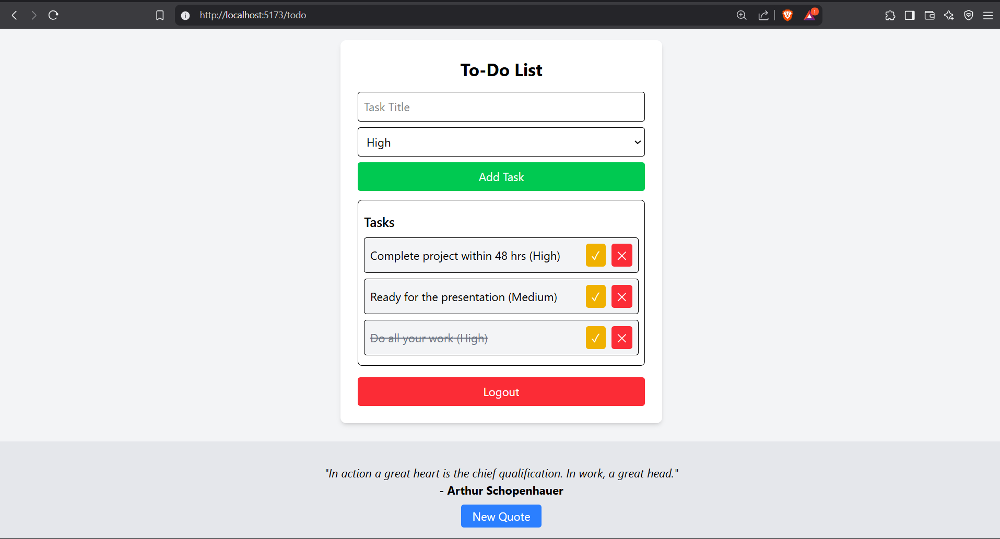

# 🚀 Advanced React To-Do Application
An advanced to-do list application built with React, Redux Toolkit, React Hook Form, and API integration. This project allows users to manage tasks with authentication, task prioritization, and real-time quote fetching.

---

## 📌 Features
✅ **User Authentication** – Simple login/logout functionality (mock authentication using Redux).
✅ **Task Management** – Add, delete, and complete tasks with different priority levels.
✅ **Persistent Storage** – Tasks and authentication state persist across sessions.
✅ **Quote API Integration** – Fetches a motivational quote using the API Ninjas Quotes API.
✅ **Responsive Design** – Optimized for mobile, tablet, and desktop views.
✅ **Redux Toolkit for State Management** – Uses Redux Toolkit for tasks, authentication, and API calls.

---

# 🛠️ Technologies Used 
- **React** (Functional Components, Hooks)
- **Redux Toolkit** (State Management)
- **React Hook Form** (Form Handling)
- **Tailwind CSS** (Styling)
- **API Ninjas Quotes API** (Fetching Motivational Quotes)

---

## 🏗️ Installation & Setup
Follow these steps to set up and run the project locally.

### 1️⃣ Clone the Repository
```sh
git clone https://github.com/Mohak0325/todo-app.git
cd todo-app
```
### 2️⃣ Install Dependencies
```sh
npm install
```
### 3️⃣ Create .env File (For API Key)
Inside the project folder, create a .env file and add your API Ninjas key:

### 4️⃣ Start the Development Server
```sh
npm run dev
```

## 🚀 Usage
1️⃣ **Login** – Click the login button to access the to-do list.
2️⃣ **Add a Task** – Enter a task, set its priority, and click "Add Task".
3️⃣ **Mark as Complete** – Click the ✓ button to mark a task as completed.
4️⃣ **Delete a Task** – Click the ✕ button to remove a task.
5️⃣ **Logout** – Click the logout button to return to the login screen.
6️⃣ **Quote Refresh** – A new motivational quote is fetched when the page loads.


## 📸 Screenshots  

### 🏠 Login Page  
  

### ✅ To-Do List Page  
  


# 🔗 API Integration
The application fetches motivational quotes from API Ninjas. The request is made using Redux Thunk for asynchronous state management.

## 🛠️ Future Improvements
🔹 Drag & Drop for Task Reordering

🔹 Deadline Reminders & Notifications

🔹 Backend Integration (MERN Stack)

🔹 Dark Mode Support